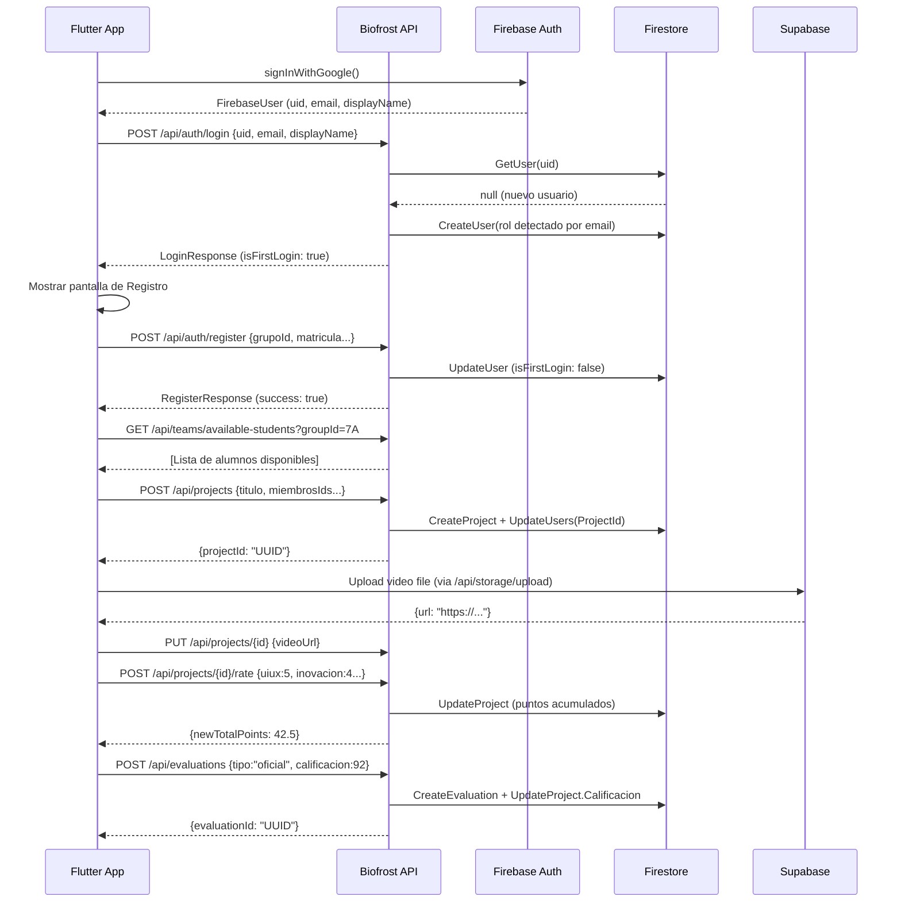

# 📘 Biofrost Hub — Documentación Maestra de la API
> **Arquitectura:** .NET 8 · Vertical Slicing · MediatR · Google Firestore · Supabase Storage · Firebase Auth
> **Fecha de generación:** 2026-03-18
> **Estado:** v2.0

---

## 📌 Tabla de Contenidos

1. [Arquitectura General](#1-arquitectura-general)
2. [Módulo Auth — Autenticación e Identidad](#2-módulo-auth--autenticación-e-identidad)
3. [Módulo Users — Perfil de Usuario](#3-módulo-users--perfil-de-usuario)
4. [Módulo Teams — Formación de Equipos](#4-módulo-teams--formación-de-equipos)
5. [Módulo Projects — Gestión de Proyectos](#5-módulo-projects--gestión-de-proyectos)
6. [Motor de Rating Social (RubricVote)](#6-motor-de-rating-social-rubricvote)
7. [Módulo Evaluations — Rúbricas Institucionales](#7-módulo-evaluations--rúbricas-institucionales)
8. [Módulo Storage — Gestión de Archivos](#8-módulo-storage--gestión-de-archivos)
9. [Módulo Admin — Gobernanza del Sistema](#9-módulo-admin--gobernanza-del-sistema)
10. [Modelos del Dominio (Shared/Domain)](#10-modelos-del-dominio-shareddomain)
11. [Roles y Permisos](#11-roles-y-permisos)
12. [Flujo de Trabajo Completo](#12-flujo-de-trabajo-completo)
13. [Resumen de Seguridad (Senior Code Review)](#13-resumen-de-seguridad-senior-code-review)

---

## 1. Arquitectura General

Biofrost Hub usa la arquitectura **Vertical Slicing**, donde cada feature es un módulo autónomo con su propio controlador, handlers (Command/Query via MediatR), DTOs y validaciones. Esto facilita el mantenimiento y el escalado independiente de cada funcionalidad.

```
IntegradorHub.API/
├── Features/
│   ├── Auth/           → Login + Registro
│   ├── Users/          → Perfil público y redes sociales
│   ├── Teams/          → Consulta de alumnos/docentes disponibles
│   ├── Projects/       → CRUD de proyectos + canvas + rating
│   ├── Evaluations/    → Rúbricas oficiales y sugerencias
│   ├── Storage/        → Carga de archivos a Supabase
│   └── Admin/          → Catálogos (Carreras, Materias, Grupos, Usuarios)
└── Shared/
    ├── Domain/Entities → User, Project, Evaluation, Group, Materia...
    ├── Domain/Enums    → UserRole, ProjectState
    ├── Domain/Interfaces → IUserRepository, IProjectRepository...
    └── Infrastructure/ → FirestoreContext, Repositories, Services
```

### Servicios externos
| Servicio | Uso |
| :--- | :--- |
| **Firebase Auth** | Identity Provider. Emite el UID por usuario. |
| **Google Firestore** | Base de datos NoSQL. Colecciones: `users`, `projects`, `evaluations`, `groups`, `materias`, `carreras`. |
| **Supabase Storage** | Almacenamiento de archivos multimedia (imágenes, videos, PDFs). |

---

## 2. Módulo Auth — Autenticación e Identidad

### Contexto
El módulo [Auth](file:///c:/Users/fitch/source/visual/Biofrost-dev-1/Api/src/IntegradorHub.API/Features/Auth/AuthController.cs#15-19) es el punto de entrada al ecosistema. No solo gestiona la autenticación (delegada a Firebase), sino que implementa una lógica de **Auto-Identificación de Roles** mediante el análisis de patrones en el correo institucional. Detecta automáticamente si un usuario es `Alumno`, [Docente](file:///c:/Users/fitch/source/visual/Biofrost-dev-1/Api/src/IntegradorHub.API/Shared/Domain/Entities/AsignacionDocente.cs#8-20) o `Invitado` desde su primer acceso.

**Ruta base:** `/api/auth`

---

### POST `/api/auth/login`
Sincroniza la sesión de Firebase con el perfil de Biofrost. Si el usuario no existe, lo crea. Si existe, sincroniza nombre y foto.

**Headers:** `Content-Type: application/json`

**Body:**
```json
{
  "firebaseUid": "abc123xyz",
  "email": "22090123@utmetropolitana.edu.mx",
  "displayName": "Juan Pérez",
  "photoUrl": "https://lh3.googleusercontent.com/..."
}
```

| Campo | Tipo | Requerido | Descripción |
| :--- | :--- | :--- | :--- |
| `firebaseUid` | `string` | ✅ | UID único de Firebase Auth. |
| `email` | `string` | ✅ | Email institucional o personal. Clave para la detección de rol. |
| `displayName` | `string` | ✅ | Nombre público de Google/Firebase. |
| `photoUrl` | `string` | ❌ | URL de la foto de perfil de Google. |

**Respuesta 200 OK:**
```json
{
  "userId": "abc123xyz",
  "email": "22090123@utmetropolitana.edu.mx",
  "nombre": "Juan Pérez",
  "rol": "Alumno",
  "isFirstLogin": true,
  "grupoId": null,
  "grupoNombre": null,
  "matricula": "22090123",
  "carreraId": null,
  "apellidoPaterno": null,
  "apellidoMaterno": null,
  "fotoUrl": "https://...",
  "profesion": null,
  "especialidadDocente": null,
  "organizacion": null,
  "createdAt": "2026-03-18T22:00:00Z",
  "redesSociales": {}
}
```

**Lógica de detección de roles (Email Value Object):**
- Email con patrón de matrícula `NNNNNNNN@utmetropolitana.edu.mx` → `Alumno`
- Email de dominio docente institucional → [Docente](file:///c:/Users/fitch/source/visual/Biofrost-dev-1/Api/src/IntegradorHub.API/Shared/Domain/Entities/AsignacionDocente.cs#8-20)
- Cualquier otro dominio → `Invitado`

---

### POST `/api/auth/register`
Completa el perfil del usuario tras su primer inicio de sesión. Permite asignar grupo, matrícula y datos académicos.

**Headers:** `Content-Type: application/json`

**Body para Alumno:**
```json
{
  "firebaseUid": "abc123xyz",
  "email": "22090123@utmetropolitana.edu.mx",
  "nombre": "Juan",
  "apellidoPaterno": "Pérez",
  "apellidoMaterno": "García",
  "rol": "Alumno",
  "grupoId": "grupo_7A",
  "matricula": "22090123",
  "carreraId": "carrera_DSW"
}
```

**Body para Docente:**
```json
{
  "firebaseUid": "def456abc",
  "email": "profesor@utmetropolitana.edu.mx",
  "nombre": "Dr. López",
  "rol": "Docente",
  "profesion": "Ingeniero en Sistemas",
  "carrerasIds": ["carrera_DSW", "carrera_MKT"],
  "gruposDocente": ["grupo_7A", "grupo_8B"]
}
```

| Campo | Tipo | Requerido | Descripción |
| :--- | :--- | :--- | :--- |
| `firebaseUid` | `string` | ✅ | UID de Firebase. |
| `email` | `string` | ✅ | Email del usuario. |
| `nombre` | `string` | ✅ | Nombre(s). |
| [rol](file:///c:/Users/fitch/source/visual/Biofrost-dev-1/Api/src/IntegradorHub.API/Features/Auth/AuthController.cs#15-19) | `string` | ✅ | `Alumno` / [Docente](file:///c:/Users/fitch/source/visual/Biofrost-dev-1/Api/src/IntegradorHub.API/Shared/Domain/Entities/AsignacionDocente.cs#8-20) / `Invitado`. |
| `grupoId` | `string` | ❌ | Para Alumnos, ID del grupo académico. |
| `matricula` | `string` | ❌ | Matrícula académica. |
| `carreraId` | `string` | ❌ | Para Alumnos, ID de la carrera. |
| `profesion` | `string` | ❌ | Para Docentes, su título profesional. |
| `asignaciones` | `AsignacionDocente[]` | ❌ | Para Docentes, estructura de materias/grupos. |
| `gruposDocente` | `string[]` | ❌ | Alternativa frontend para docentes: IDs de grupos. |
| `carrerasIds` | `string[]` | ❌ | Alternativa frontend para docentes: IDs de carreras. |

**Respuesta 200 OK:**
```json
{
  "success": true,
  "message": "Usuario registrado correctamente",
  "userId": "abc123xyz"
}
```

**Respuesta 400 Bad Request:**
```json
{
  "success": false,
  "message": "Descripción del error"
}
```

---

## 3. Módulo Users — Perfil de Usuario

### Contexto
Gestiona la identidad pública y las redes sociales de los usuarios. Usado principalmente desde la pantalla de Perfil de la app móvil.

**Ruta base:** `/api/users`

---

### GET `/api/users/{userId}/profile`
Obtiene el perfil público completo de un usuario.

**Parámetro de ruta:**
| Parámetro | Tipo | Descripción |
| :--- | :--- | :--- |
| `userId` | `string` | UID de Firebase del usuario a consultar. |

**Respuesta 200 OK — [PublicProfileDto](file:///c:/Users/fitch/source/visual/Biofrost-dev-1/Api/src/IntegradorHub.API/Features/Users/GetPublicProfile/PublicProfileDto.cs#5-22):**
```json
{
  "id": "abc123xyz",
  "email": "22090123@utmetropolitana.edu.mx",
  "nombre": "Juan Pérez",
  "apellidoPaterno": "Pérez",
  "apellidoMaterno": "García",
  "fotoUrl": "https://supabase.co/...",
  "rol": "Alumno",
  "matricula": "22090123",
  "grupoId": "grupo_7A",
  "carreraId": "carrera_DSW",
  "profesion": null,
  "especialidadDocente": null,
  "organizacion": null,
  "createdAt": "2026-01-15T10:00:00Z",
  "redesSociales": {
    "github": "https://github.com/juan",
    "linkedin": "https://linkedin.com/in/juan"
  }
}
```

**Respuestas de error:**
| Código | Descripción |
| :--- | :--- |
| `400` | El `userId` está vacío. |
| `404` | El usuario no existe en Firestore. |

---

### PUT `/api/users/{userId}/photo`
Actualiza la URL de la foto de perfil del usuario. La imagen debe subirse previamente a Supabase vía `/api/storage/upload`.

**Body:**
```json
{
  "fotoUrl": "https://supabase.co/storage/v1/object/public/profiles/abc123.jpg"
}
```

**Respuesta 200 OK:**
```json
{
  "userId": "abc123xyz",
  "fotoUrl": "https://supabase.co/..."
}
```

---

### PUT `/api/users/{userId}/social`
Actualiza el directorio de redes sociales del usuario.

**Body:**
```json
{
  "redesSociales": {
    "github": "https://github.com/user",
    "linkedin": "https://linkedin.com/in/user",
    "portfolio": "https://user.dev"
  }
}
```

**Respuesta 200 OK:**
```json
{
  "success": true,
  "message": "Redes sociales actualizadas correctamente"
}
```

---

## 4. Módulo Teams — Formación de Equipos

### Contexto
Proporciona los datos necesarios para la pantalla de "Formación de Equipo". Permite consultar qué alumnos están disponibles (sin proyecto asignado) y qué docentes están asignados al grupo del líder.

**Ruta base:** `/api/teams`

---

### GET `/api/teams/available-students?groupId={groupId}`
Lista alumnos del mismo grupo que **no tienen proyecto asignado**, disponibles para unirse a un equipo.

**Query Params:**
| Parámetro | Tipo | Requerido | Descripción |
| :--- | :--- | :--- | :--- |
| `groupId` | `string` | ✅ | ID del grupo académico. |

**Respuesta 200 OK — `List<StudentDto>`:**
```json
[
  {
    "id": "alumno_uid_1",
    "nombre": "María López",
    "matricula": "22090456",
    "fotoUrl": "https://..."
  }
]
```

---

### GET `/api/teams/available-teachers?groupId={groupId}`
Lista docentes cuyas `Asignaciones` incluyan el grupo especificado.

**Respuesta 200 OK — `List<TeacherDto>`:**
```json
[
  {
    "id": "docente_uid_1",
    "nombre": "Dr. Ramírez",
    "profesion": "Ingeniero en Software",
    "especialidadDocente": "Arquitectura de Software"
  }
]
```

---

## 5. Módulo Projects — Gestión de Proyectos

### Contexto
El módulo central de Biofrost. Gestiona el ciclo de vida completo de los proyectos: creación, actualización de canvas, gestión de miembros y eliminación. Implementa la regla de **Exclusividad** (un alumno solo puede pertenecer a un proyecto a la vez).

**Ruta base:** `/api/projects`

---

### POST `/api/projects`
Crea un nuevo proyecto y vincula a todos los miembros indicados.

**Body — [CreateProjectRequest](file:///c:/Users/fitch/source/visual/Biofrost-dev-1/Api/src/IntegradorHub.API/Features/Projects/ProjectsController.cs#248-261):**
```json
{
  "titulo": "BioPay — Sistema de Pagos Ecológico",
  "materia": "Integrador de Proyectos de Software",
  "materiaId": "materia_IPS_2024",
  "ciclo": "2024-1",
  "stackTecnologico": ["Flutter", "Firebase", ".NET 8"],
  "repositorioUrl": "https://github.com/team/biopay",
  "videoUrl": "https://youtube.com/watch?v=demo",
  "userId": "lider_uid",
  "userGroupId": "grupo_7A",
  "docenteId": "docente_uid",
  "miembrosIds": ["alumno_uid_2", "alumno_uid_3"]
}
```

| Campo | Tipo | Requerido | Validación |
| :--- | :--- | :--- | :--- |
| `titulo` | `string` | ✅ | Máx 100 caracteres. |
| `materia` | `string` | ✅ | — |
| `materiaId` | `string` | ✅ | — |
| `ciclo` | `string` | ✅ | Formato `YYYY-N` (ej: `2024-1`). |
| `stackTecnologico` | `string[]` | ✅ | Al menos 1 tecnología. |
| `repositorioUrl` | `string` | ❌ | URL absoluta válida. |
| `videoUrl` | `string` | ❌ | URL absoluta válida. |
| `userId` | `string` | ✅ | UID del líder (debe ser `Alumno`). |
| `userGroupId` | `string` | ✅ | Grupo del líder. |
| `docenteId` | `string` | ❌ | Docente asignado (debe impartir al grupo). |
| `miembrosIds` | `string[]` | ❌ | Máx 4 miembros adicionales. |

**Reglas de Negocio:**
1. Solo los `Alumno` pueden crear proyectos.
2. El Líder no debe tener un proyecto previo.
3. Todos los miembros deben ser del mismo grupo que el líder.
4. Ningún miembro debe tener ya un proyecto asignado.
5. El docente debe estar asignado al grupo del líder.
6. El equipo máximo es de 5 personas (Líder + 4 miembros).

**Respuesta 201 Created:**
```json
{ "projectId": "UUID-generado-del-proyecto" }
```

**Respuestas de error:**
| Código | Descripción |
| :--- | :--- |
| `403 Forbidden` | El líder ya tiene un proyecto o no es Alumno. |
| `422` / `400` | El docente no está asignado al grupo / miembro ocupado. |

---

### GET `/api/projects/public`
Lista todos los proyectos marcados como públicos para la galería del Showcase.

**Respuesta 200 OK — `List<PublicProjectDto>`** (listado simplificado).

---

### GET `/api/projects/{id}`
Obtiene el detalle completo de un proyecto, incluyendo miembros, canvas y puntuaciones.

**Respuesta 200 OK — `ProjectDetailsDto`.**
| `404` | Proyecto no encontrado. |

---

### GET `/api/projects/my-project?userId={userId}`
Obtiene el proyecto al que pertenece el usuario autenticado.

**Respuesta 200 OK** o `404 Not Found` si no tiene proyecto asignado.

---

### GET `/api/projects/group/{groupId}`
Lista todos los proyectos de un grupo académico.

---

### GET `/api/projects/teacher/{teacherId}`
Lista proyectos asignados a un docente específico.

---

### POST `/api/projects/{id}/members`
Agrega un nuevo integrante al proyecto (solo el líder puede hacerlo).

**Body:**
```json
{
  "leaderId": "lider_uid",
  "emailOrMatricula": "22090789"
}
```

---

### DELETE `/api/projects/{id}/members/{memberId}?requestingUserId={uid}`
Retira a un miembro del equipo y libera su `ProjectId`.

---

### PUT `/api/projects/{id}`
Actualiza datos generales del proyecto (Título, Video, Visibilidad pública).

**Body — [UpdateProjectRequest](file:///c:/Users/fitch/source/visual/Biofrost-dev-1/Api/src/IntegradorHub.API/Features/Projects/ProjectsController.cs#239-245):**
```json
{
  "titulo": "BioPay v2",
  "videoUrl": "https://youtube.com/watch?v=demo2",
  "canvasBlocks": [],
  "esPublico": true
}
```

---

### PUT `/api/projects/{id}/canvas`
Actualiza los bloques del Business Model Canvas del proyecto.

**Body — [UpdateCanvasRequest](file:///c:/Users/fitch/source/visual/Biofrost-dev-1/Api/src/IntegradorHub.API/Features/Projects/ProjectsController.cs#246-247):**
```json
{
  "userId": "lider_uid",
  "blocks": [
    { "tipo": "problema", "contenido": "Descripción del problema..." }
  ]
}
```

---

### DELETE `/api/projects/{id}?requestingUserId={uid}`
Elimina el proyecto y libera el `ProjectId` de todos los miembros.

---

## 6. Motor de Rating Social (RubricVote)

### POST `/api/projects/{id}/rate`
Permite a la comunidad (docentes, invitados, otros alumnos) calificar un proyecto con 4 criterios de rúbrica.

**⚠️ Restricción:** El líder del proyecto no puede votar por su propio proyecto.

**Body — [RateProjectRequest](file:///c:/Users/fitch/source/visual/Biofrost-dev-1/Api/src/IntegradorHub.API/Features/Projects/ProjectsController.cs#237-238):**
```json
{
  "userId": "evaluador_uid",
  "uiux": 5,
  "inovacion": 4,
  "presentacion": 5,
  "impacto": 3
}
```

| Criterio | Rango | Puntos Internos |
| :--- | :--- | :--- |
| `uiux` | 1–5 | × 2.5 pts |
| `inovacion` | 1–5 | × 2.5 pts |
| `presentacion` | 1–5 | × 2.5 pts |
| `impacto` | 1–5 | × 2.5 pts |

**Puntaje máximo total:** `5 * 4 * 2.5 = 50 pts`

**Respuesta 200 OK — [RateProjectResponse](file:///c:/Users/fitch/source/visual/Biofrost-dev-1/Api/src/IntegradorHub.API/Features/Projects/Rate/RateProjectHandler.cs#39-48):**
```json
{
  "success": true,
  "message": "Voto registrado correctamente",
  "newTotalPoints": 42.5,
  "puntosUIUX": 12.5,
  "puntosInovacion": 10.0,
  "puntosPresentacion": 12.5,
  "puntosImpacto": 7.5
}
```

> **Idempotencia:** Si el usuario ya había votado anteriormente, el sistema resta el voto antiguo antes de sumar el nuevo, permitiendo actualizar la evaluación.

---

## 7. Módulo Evaluations — Rúbricas Institucionales

### Contexto
Este módulo es la distinción entre el impacto social (Rating) y la **validez académica formal**. Implementa una jerarquía de permisos estricta para proteger la integridad de las calificaciones institucionales.

**Ruta base:** `/api/evaluations`

---

### POST `/api/evaluations`
Crea una evaluación (oficial o sugerencia) sobre un proyecto.

**Body — [CreateEvaluationRequest](file:///c:/Users/fitch/source/visual/Biofrost-dev-1/Api/src/IntegradorHub.API/Features/Evaluations/EvaluationsController.cs#74-82):**
```json
{
  "projectId": "UUID-del-proyecto",
  "docenteId": "docente_uid",
  "docenteNombre": "Dr. Ramírez",
  "tipo": "oficial",
  "contenido": "El proyecto demuestra madurez técnica y propuesta de valor clara.",
  "calificacion": 92
}
```

| Campo | Tipo | Requerido | Descripción |
| :--- | :--- | :--- | :--- |
| `projectId` | `string` | ✅ | Proyecto a evaluar. |
| `docenteId` | `string` | ✅ | UID del evaluador. |
| `tipo` | `string` | ✅ | `"oficial"` o `"sugerencia"`. |
| `contenido` | `string` | ✅ | Retroalimentación o justificación. |
| `calificacion` | `int` | ⚠️ | Solo para `"oficial"`. Rango: 0–100. |

**Jerarquía de Permisos:**
| Rol | Tipo Permitido |
| :--- | :--- |
| `Invitado` | Solo `"sugerencia"`. |
| [Docente](file:///c:/Users/fitch/source/visual/Biofrost-dev-1/Api/src/IntegradorHub.API/Shared/Domain/Entities/AsignacionDocente.cs#8-20) (NO titular) | Solo `"sugerencia"`. |
| [Docente](file:///c:/Users/fitch/source/visual/Biofrost-dev-1/Api/src/IntegradorHub.API/Shared/Domain/Entities/AsignacionDocente.cs#8-20) Titular del proyecto | `"oficial"` + `"sugerencia"`. |
| [Admin](file:///c:/Users/fitch/source/visual/Biofrost-dev-1/Api/src/IntegradorHub.API/Features/Admin/AdminController.cs#13-39) / `SuperAdmin` | `"oficial"` + `"sugerencia"`. |

**Respuesta 200 OK:**
```json
{
  "success": true,
  "message": "Evaluación creada correctamente",
  "evaluationId": "UUID-evaluacion"
}
```

**Efecto secundario:** Si el tipo es `"oficial"`, la `Calificacion` del proyecto en Firestore se actualiza automáticamente.

---

### GET `/api/evaluations/project/{projectId}`
Lista todas las evaluaciones registradas para un proyecto.

**Respuesta 200 OK — `List<EvaluationDto>`:**
```json
[
  {
    "id": "eval_uuid",
    "docenteNombre": "Dr. Ramírez",
    "tipo": "oficial",
    "contenido": "Excelente propuesta...",
    "calificacion": 92,
    "esPublico": false,
    "createdAt": "2026-03-18T22:00:00Z"
  }
]
```

---

### PATCH `/api/evaluations/{id}/visibility`
Permite al equipo del proyecto controlar si una evaluación es visible públicamente en el Showcase.

**Body — [ChangeVisibilityRequest](file:///c:/Users/fitch/source/visual/Biofrost-dev-1/Api/src/IntegradorHub.API/Features/Evaluations/EvaluationsController.cs#72-73):**
```json
{
  "userId": "lider_uid",
  "esPublico": true
}
```

> ⚠️ Las evaluaciones se crean con `EsPublico = false` por defecto.

---

## 8. Módulo Storage — Gestión de Archivos

### Contexto
Actúa como proxy hacia Supabase Storage. El flujo correcto es: (1) subir el archivo aquí → (2) obtener la `publicUrl` → (3) guardarla en Firestore (en `fotoUrl`, `videoUrl`, etc.).

**Ruta base:** `/api/storage`

---

### POST `/api/storage/upload?folder={folder}`
Sube un archivo individual a Supabase.

**Content-Type:** `multipart/form-data`

**Query Params:**
| Parámetro | Tipo | Valor por defecto | Descripción |
| :--- | :--- | :--- | :--- |
| `folder` | `string` | `"projects"` | Carpeta destino en el bucket. Usar `"profiles"` para fotos. |

**Límites y tipos permitidos:**
| Restricción | Valor |
| :--- | :--- |
| Tamaño máximo (upload único) | 500 MB |
| Tamaño máximo (upload múltiple) | 10 MB por archivo |
| Formatos permitidos | JPEG, PNG, GIF, WebP, PDF, MP4, WebM, MOV |

**Respuesta 200 OK:**
```json
{
  "path": "projects/uuid-filename.mp4",
  "url": "https://supabase.co/storage/v1/object/public/...",
  "fileName": "demo.mp4",
  "contentType": "video/mp4",
  "size": 47318720
}
```

---

### POST `/api/storage/upload-multiple`
Sube múltiples archivos en una sola solicitud. Los errores parciales no abortan el proceso.

**Respuesta 200 OK:**
```json
{
  "uploaded": [...],
  "errors": ["demo2.exe: Invalid file type"]
}
```

---

### DELETE `/api/storage/{*filePath}`
Elimina un archivo de Supabase usando su ruta interna.

**Respuesta 200 OK:** `{ "message": "File deleted successfully" }`  
**Respuesta 404:** `{ "error": "File not found" }`

---

## 9. Módulo Admin — Gobernanza del Sistema

### Contexto
Proporciona los endpoints para poblar y gestionar los catálogos maestros del sistema (Carreras, Materias y Grupos). Solo accesible para usuarios con rol [Admin](file:///c:/Users/fitch/source/visual/Biofrost-dev-1/Api/src/IntegradorHub.API/Features/Admin/AdminController.cs#13-39) o `SuperAdmin`.

**Ruta base:** `/api/admin`

---

### POST `/api/admin/seed-admin`
Crea el usuario administrador inicial directamente en Firestore. **Uso único en setup inicial.**

**Body:**
```json
{
  "uid": "firebase_uid_del_admin",
  "email": "admin@institucion.edu.mx"
}
```

> ⚠️ **Advertencia:** Este endpoint debe ser **eliminado o protegido con una API Key** antes de pasar a producción.

---

### Grupos (`/api/admin/groups`)
| Método | Endpoint | Descripción |
| :--- | :--- | :--- |
| `GET` | `/api/admin/groups` | Lista todos los grupos académicos. |
| `POST` | `/api/admin/groups` | Crea un nuevo grupo. |
| `PUT` | `/api/admin/groups/{id}` | Actualiza datos de un grupo. |
| `DELETE` | `/api/admin/groups/{id}` | Elimina un grupo. |

---

### Materias (`/api/admin/materias`)
| Método | Endpoint | Descripción |
| :--- | :--- | :--- |
| `GET` | `/api/admin/materias` | Lista todas las materias registradas. |
| `POST` | `/api/admin/materias` | Crea una nueva materia. |

---

### Carreras (`/api/admin/carreras`)
| Método | Endpoint | Descripción |
| :--- | :--- | :--- |
| `GET` | `/api/admin/carreras` | Lista todas las carreras del catálogo. |
| `POST` | `/api/admin/carreras` | Registra una nueva carrera. |

---

### Usuarios Admin (`/api/admin/users`)
| Método | Endpoint | Descripción |
| :--- | :--- | :--- |
| `GET` | `/api/admin/users` | Lista todos los usuarios del sistema. |
| `PUT` | `/api/admin/users/{id}` | Actualiza rol u otros datos de un usuario. |

---

## 10. Modelos del Dominio (Shared/Domain)

### Entidad: [User](file:///c:/Users/fitch/source/visual/Biofrost-dev-1/Api/src/IntegradorHub.API/Shared/Domain/Entities/User.cs#6-80)
| Campo Firestore | Tipo | Descripción |
| :--- | :--- | :--- |
| `email` | `string` | Email del usuario. |
| `nombre` | `string` | Nombre(s). |
| `apellido_paterno` | `string` | — |
| [rol](file:///c:/Users/fitch/source/visual/Biofrost-dev-1/Api/src/IntegradorHub.API/Features/Auth/AuthController.cs#15-19) | `string` | Alumno / Docente / Invitado / Admin / SuperAdmin |
| `grupo_id` | `string?` | Para Alumnos. |
| `carrera_id` | `string?` | Para Alumnos. |
| `project_id` | `string?` | Proyecto actual (Exclusividad). |
| `matricula` | `string?` | Matrícula académica. |
| `asignaciones` | `AsignacionDocente[]?` | Solo para Docentes. |
| `organizacion` | `string?` | Solo para Invitados. |
| `profesion` | `string?` | Solo para Docentes. |
| `redes_sociales` | `Dictionary<string,string>?` | Mapa de plataformas. |
| `is_first_login` | `bool` | Indica si debe completar el perfil. |

---

### Entidad: [AsignacionDocente](file:///c:/Users/fitch/source/visual/Biofrost-dev-1/Api/src/IntegradorHub.API/Shared/Domain/Entities/AsignacionDocente.cs#8-20)
| Campo Firestore | Tipo | Descripción |
| :--- | :--- | :--- |
| `carrera_id` | `string` | ID de la carrera asignada. |
| `materia_id` | `string` | ID de la materia que imparte. |
| `grupos_ids` | `string[]` | Grupos en los que imparte esa materia. |

---

### Entidad: [Project](file:///c:/Users/fitch/source/visual/Biofrost-dev-1/Api/src/IntegradorHub.API/Features/Projects/ProjectsController.cs#219-235)
| Campo Firestore | Tipo | Descripción |
| :--- | :--- | :--- |
| `titulo` | `string` | Nombre del proyecto. |
| `materia_id` | `string` | Materia vinculada. |
| `ciclo` | `string` | Ciclo escolar (ej: `2024-1`). |
| `lider_id` | `string` | UID del alumno líder. |
| `miembros_ids` | `string[]` | UIDs de todos los miembros. |
| `docente_id` | `string?` | UID del docente titular. |
| `estado` | `string` | `Borrador` / `Activo` / etc. |
| `calificacion` | `double?` | Nota oficial (0-100). |
| `puntos_totales` | `double` | Acumulador de rating social. |
| `conteo_votos` | `int` | Total de votantes únicos. |
| `votantes` | `Dictionary<string,object>` | Mapa de votos individuales. |

---

### Entidad: [Evaluation](file:///c:/Users/fitch/source/visual/Biofrost-dev-1/Api/src/IntegradorHub.API/Shared/Domain/Entities/Evaluation.cs#5-47)
| Campo Firestore | Tipo | Descripción |
| :--- | :--- | :--- |
| `project_id` | `string` | Proyecto evaluado. |
| `docente_id` | `string` | Evaluador. |
| `tipo` | `string` | `"oficial"` o `"sugerencia"`. |
| `contenido` | `string` | Feedback textual. |
| `calificacion` | `double?` | Solo si `tipo == "oficial"`. |
| `es_publico` | `bool` | Visibilidad en el Showcase. Por defecto `false`. |
| `puntos_otorgados` | `object?` | Datos de rúbrica extendida (futuro). |

---

## 11. Roles y Permisos

| Rol | Login/Register | Crear Proyecto | Evaluar (Sugerencia) | Evaluar (Oficial) | Gestión Admin |
| :--- | :---: | :---: | :---: | :---: | :---: |
| `Alumno` | ✅ | ✅ | ❌ | ❌ | ❌ |
| `Invitado` | ✅ | ❌ | ✅ | ❌ | ❌ |
| [Docente](file:///c:/Users/fitch/source/visual/Biofrost-dev-1/Api/src/IntegradorHub.API/Shared/Domain/Entities/AsignacionDocente.cs#8-20) (No Titular) | ✅ | ❌ | ✅ | ❌ | ❌ |
| [Docente](file:///c:/Users/fitch/source/visual/Biofrost-dev-1/Api/src/IntegradorHub.API/Shared/Domain/Entities/AsignacionDocente.cs#8-20) (Titular del proyecto) | ✅ | ❌ | ✅ | ✅ | ❌ |
| [Admin](file:///c:/Users/fitch/source/visual/Biofrost-dev-1/Api/src/IntegradorHub.API/Features/Admin/AdminController.cs#13-39) / `SuperAdmin` | ✅ | ❌ | ✅ | ✅ | ✅ |

---

## 12. Flujo de Trabajo Completo



---

## 13. Resumen de Seguridad (Senior Code Review)

| ID | Área | Severidad | Descripción | Recomendación |
| :--- | :--- | :--- | :--- | :--- |
| SEC-01 | Auth | 🟡 Media | Correos hardcodeados para asignar `SuperAdmin`. | Mover a [appsettings.json](file:///c:/Users/fitch/source/visual/Biofrost-dev-1/Api/src/IntegradorHub.API/appsettings.json) o Custom Claims de Firebase. |
| SEC-02 | Users | 🔴 Alta | Los endpoints de edición de perfil no verifican que el Token JWT pertenezca al `userId` de la ruta. | Validar `User.Identity.Name == userId` en los Handlers. |
| SEC-03 | Storage | 🔴 Alta | [StorageController](file:///c:/Users/fitch/source/visual/Biofrost-dev-1/Api/src/IntegradorHub.API/Features/Storage/StorageController.cs#13-18) no tiene `[Authorize]`. Cualquiera puede subir archivos. | Añadir middleware de autenticación. |
| SEC-04 | Admin | 🔴 Alta | `POST /api/admin/seed-admin` está expuesto públicamente. | Eliminar en producción o proteger con API Key secreta. |
| SEC-05 | Projects | 🟢 Bajo | Actualización de proyectos usa `"temp-user-id"` hardcodeado. | Leer el ID del usuario desde el token JWT autenticado. |
| SEC-06 | Evaluations | 🟡 Media | Strings de roles (`"admin"`, `"SuperAdmin"`) duplicados como Magic Strings. | Centralizar en el enum `UserRole` del `SharedCore`. |
| SEC-07 | Projects | 🟡 Media | La actualización masiva de `ProjectId` en usuarios se hace de forma secuencial (N queries). | Usar `WriteBatch` de Firestore para atomicidad real. |
